# Microcc
---
- 课程名称：编程语言原理与编译
- 实验项目：期末大作业
- 专业班级：计算机1801
- 学生学号：31801087，31801082
- 学生姓名：张钧泽，莫明达
- 实验指导教师: 郭鸣
- https://github.com/zhangjunze1/Microc_optimize/tree/master
---

## 简介
这是一个编译原理大作业，主要基于microC完成的。

本次大作业，我们在解释器中做了大量的尝试，想对break和continue还有return做处理，修改了环境变量以达到目的。所以在编译器中就没有实现break、continue和return的功能。编译器能够很好的参照优秀作业去学习，而解释器需要按照自己的思路设计词法分析器，语法分析器，以及变量定义，搭建框架等等。


## 结构
- 前端：由`F#`语言编写而成  
  - `Clex.fsl`生成的`Clex.fs`词法分析器。
  - `CPar.fsy`生成的`Cpar.fs`语法分析器。
  - `Absyn.fs` 定义了抽象语法树
  - `Machine.fs`定义了中间表示的生成指令集
  - `interp.fs`解释器
  - `Contcomp.fs`编译器

- 编译器后端：由`Java`语言编写而成
  - `Machine.java`生成`Machine.class`虚拟机与`Machinetrace.class`堆栈追踪

- 测试集：测试程序放在`test`文件夹内

- 库：`.net`支持
  - `FsLexYacc.Runtime.dll`
## 用法
- ` dotnet restore  interpc.fsproj `
- ` dotnet clean  interpc.fsproj  `
- ` dotnet build -v n interpc.fsproj  `
构建解释器 

- ` dotnet run -p interpc.fsproj test/for.c `
测试样例for循环

其余详见上手流程


- ` dotnet restore  microcc.fsproj  `
- ` dotnet clean  microcc.fsproj  `
- ` dotnet build  microcc.fsproj  `
构建编译器

- ` dotnet run -p microc.fsproj test/for.c  `
此处test/for.c这个部分是你要运行的.c文件 对应生成.out文件（机器代码）

- ` javac Machine.java  `
- ` java Machine test/for.out  `
machine.java 用java环境 
编译生成新的class文件--虚拟机功能


## 功能实现
- 变量定义
  - 简介：原本的microC只有变量声明，我们改进了它使它具有变量定义，且在local环境都具有变量定义同时赋值的功能。
  
  - int 
    ```C
    // int.c
    int a;
    int b;
    void main() {
      int n=1;
      a = 1;
      b = 2+3;
      print("%d",n);
      print("%d",a);
      print("%d",b);
    }
    
    ```
    
	 - 答案  
   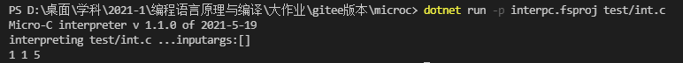
  
  - 语法树（解释器） 
  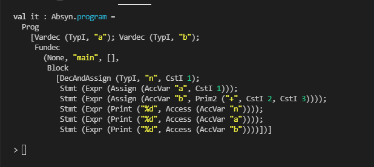
  - 堆栈图（编译器）
  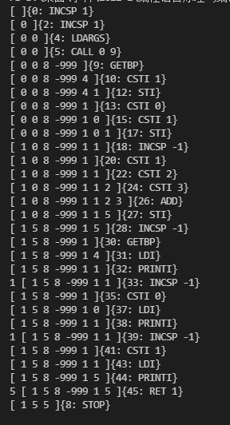   

---

- char 类型
  - 简介：可定义赋值
  - 例子：

    ```C
    char a;
    void main() {
    char b;
    char c='c';
    a='a';
    b='b';
    print("%d",a);
    print("%d",b);
    print("%d",c);
    }
    ```
  - 答案
     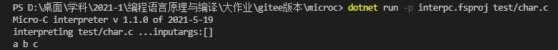
  - 语法树（解释器）：  
    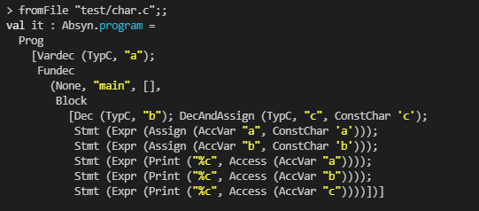
  - 运行栈追踪：  
    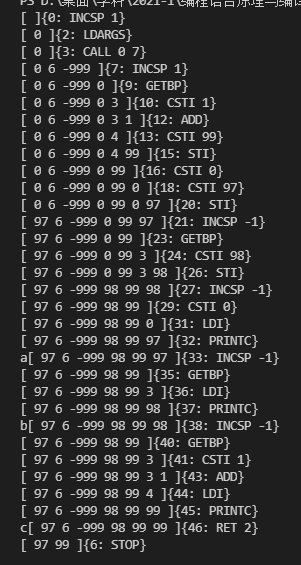

---
- 自增操作
    - 简介:包含i++ ++i -- -=等等操作
    - 例子：
        ```C
        void main() {
        int i=1;
        i++;
        print("%d",i);
        i--;
        print("%d",i);
        i+=2;
        print("%d",i);
        i-=2;
        print("%d",i);
        i*=2;
        print("%d",i);
        i/=2;
        print("%d",i);
        i%=2;
        print("%d",i);
        }
        ```
	- 语法树
        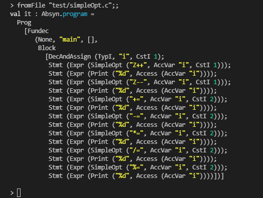
    - 运行栈追踪：  
        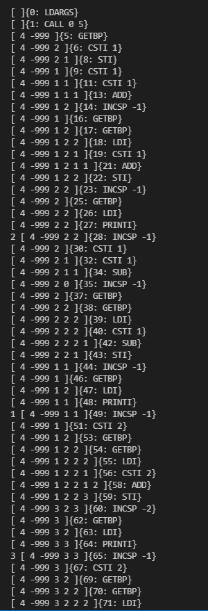
        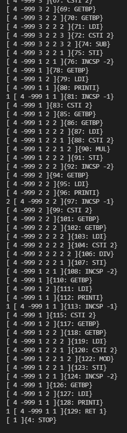
---
- FOR循环
    - 简介：增加了for循环 
    - 例子：
```C
    void main() {
    int n=5;
    int i;
    for (i = 0; i < n; i=i+1)
    {
    print("%d",i);
    }
    }
    
```
- 语法树
  
    - 运行栈追踪：  

  

---
- FOR循环 加上break
    - 简介：增加了for循环与break 
    - 例子：
```C
      void main() {
      int n=5;
      int i;
      for (i = 0; i < n; i++)
      {
      print("%d",i);
      if (i==3){break;}
      print("%d",i);
      }

}
```

​        
​    - 语法树
​        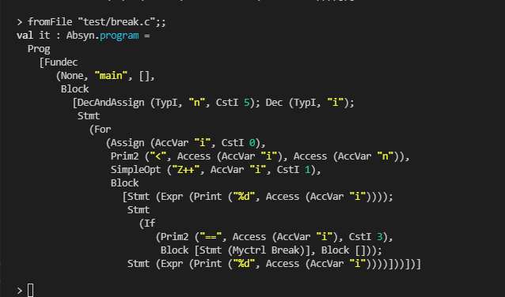
​    - 运行栈追踪：  


---
- 三目运算符
    - 简介：三目运算符 n?a:b
    - 用例：
```C
void main() {
  int n=5;
  if(n? 1:0){
    print("%d",n);
  }
}
```
- 语法树：
  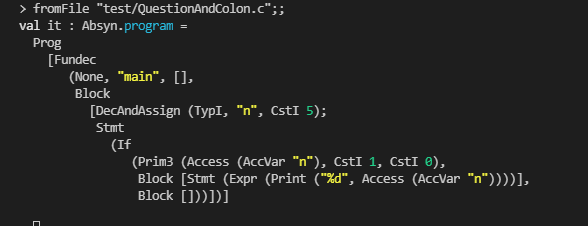
- 运行栈追踪：  

  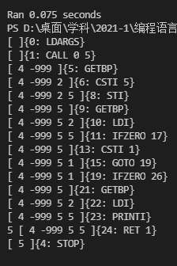 

---
- do - while
    - 简介：在判断前先运行body中的操作。 能对break continue作出反应
    - 例子：
```C
void main() {
  int i=5;
  do{
      print("%d",i);
      i=i+1;
  } while (i<4);
}
```
  - 堆栈图：
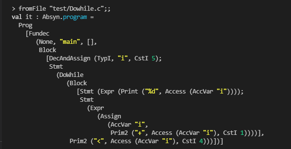
  - 运行栈追踪：
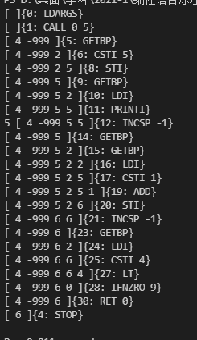


---
- 类似C的switch-case
    - 例子：
        ```C
        void main() {
        	int n=5;
        	switch(n){
        		case 1: n++;
        		case 2: n--;
        		case 5: n=n+3;
        		case 8: n=1;
        	}
        	print n;
      }
- 语法树：
  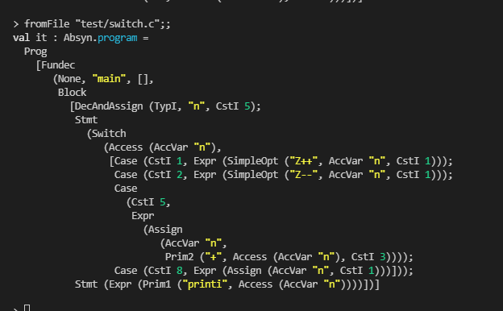

  


---

- continue功能
    - 在for while dowhile中，都加入break 和continue功能
    - 维护Label表来实现
        ```C
        void main() {
      int n=5;
      int i;
      for (i = 0; i < n; i=i+1)
      {
      print("%d",i);
      continue;
      print("%d",i);
      }
        }


- 语法树
 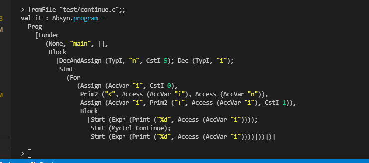
- 运行栈追踪
 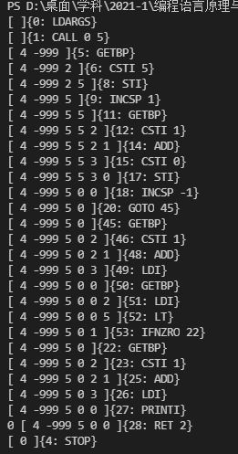

---
- break功能
```C
void main() {
  int n=5;
  int i;
  for (i = 0; i < n; i++)
  {
    print("%d",i);
    if (i==3){break;}
    print("%d",i);
  }
}
```
- 语法树
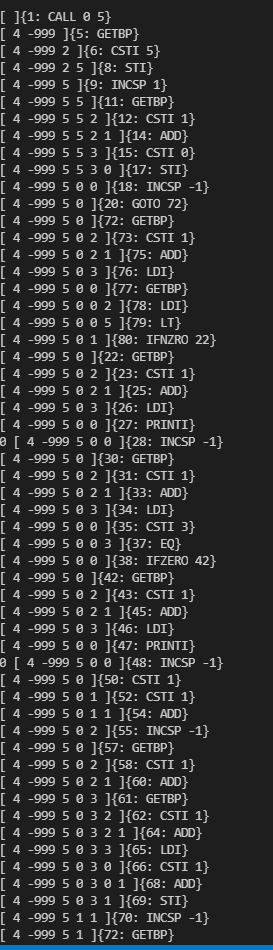
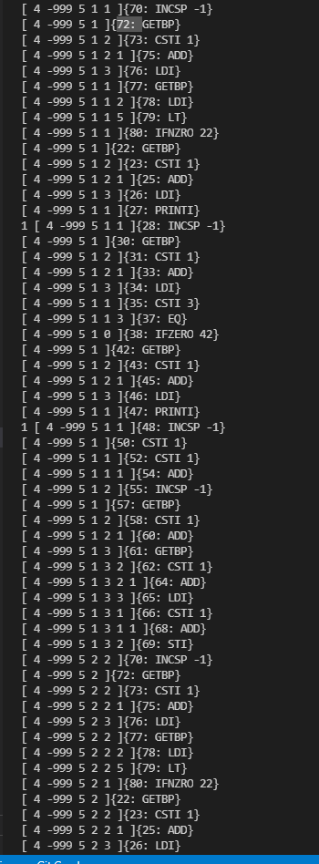
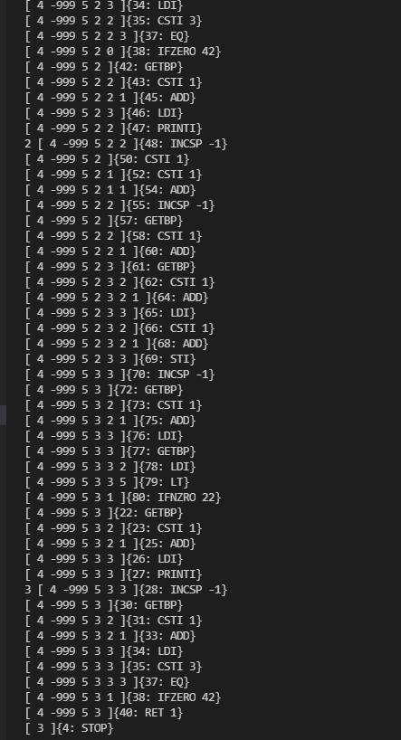

---
- return功能
    - 在函数定义中，对return的返回的实现
```

​```C
        void main(int n) {
      int q;
      q = fun(n);
      print("%d",q);
        }

	void fun(int i){
	  i=i+7;
	  return i;
	}

```
  - 语法树
 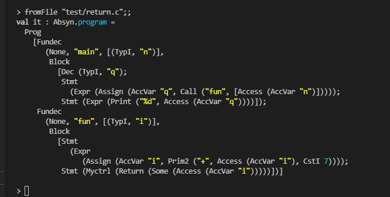

 


## 心得体会
- 张钧泽：  
    这学期大作业比较多，四个课程是四个计算机的方向，每个课程我都是组长，做的东西有点多，每天都在各个项目之间徘徊学习。F#是一个完全没接触过的全新类型的语言，资料实在太少了，一切都得自己慢慢摸索。实在是痛苦。https://docs.microsoft.com/zh-cn/dotnet/fsharp/ 从编译器和解释器的角度学习介于机器与程序之间的桥梁，让我更深一步了解一些语言模型，机器模型，语义语法结构等。加深对于计算本质的理解与运用。其实老师上课的内容，其实每节课都是感觉学得一知半解，东西实在太多，也比较难以消化，隔了几天就全忘得差不多了。不过通过这次大作业之后，收获颇丰。更是深刻理解了函数，break，continue的运行机制，以及加深对整个计算机上系统的深刻理解。
    
    - 了解了函数式编程的语言特点与特性，拓宽视野。
    - 利用F#与java完善了一个编程语言的从前端到后端的完整的搭建
    - 清楚了一些关于C语言的设计方法与局限性。
    - 理解了栈式虚拟机的工作原理与一些设计方法
    - 了解了编译和解释的过程，更深刻的学习了计算机的本质
    
    由于没每大作业时间都太紧了，如果时间再多一点的话，还可以往向编译器中补充使其完善。总而言之，这节编译原理课，收获颇丰，F#好用值得学习。编译原理的世界还是相当有趣的。  

- 莫明达：  
    本学期的编译原理学习，自己还是花了挺多时间的。前期各周的作业以及后期的大作业，都需要投入一定的精力去了解、学习。通过这次编译原理课程的学习，我了解并掌握了编译原理大致的框架和逻辑。让我更深一步了解一些语言模型，机器模型，语义语法结构等。同时，感谢郭鸣老师的教导。
    总结一下
    
    - 大作业完成中，对指令与栈结构有了更深的了解
    - 随着对fsharp的使用越加频繁，也加深了对函数式编程语言的印象
    - 过程的积累中，逐渐了解一些编译的理念，计算的思维。
    - 在大作业有些功能的完成上，还可以再优化精简。

## 技术评价

| 功能 | 对应文件 | 优  | 良  | 中  |
| ---- | -------- | --- | --- | --- |
|变量声明定义|int.c \ char.c          |√|||
|自增、自减 自运算+=等等| simpleOpt.c    |√|||
|for循环|for.c|√|||
|三目运算符|QuestionAndColon.c|√|||
|do-while|Dowhile.c|√|||
|while|while.c|√|||
|break|break.c|√|||
|continue|continue.c|√|||
|switch-case|switch.c||√||
|char 类型|char.c|√|||
|return |return.c|√|||
## 小组分工

- 张钧泽
  - 学号：31801087
  - 班级：计算机1801
    - 工作内容
      - 文档编写
      - 测试程序
      - 语法分析
      - 词法分析
      - 栈、堆设计
      - break、continue、return
- 莫明达
  - 学号：31801082
  - 班级：计算机1801
    - 工作内容
      - 文档编写
      - 测试程序
      - 语法分析
      - 词法分析
      - 自运算
  
- 权重分配表：  

| 张钧泽 | 莫明达 |
| ------ | ------ |
| 1.00  | 0.90   |


# 本组成员撰写的上手流程👉

## 上手编译原理大作业

### 解释器部分--interpreter

+ Absyn.fs    抽象语法类 与实际实践并有关联 
+ CLex.fsl    词法分析器--
	+ 例如定义 for 等关键字
+ CPar.fsy   语法分析器--
	+ 例如 定义do while 进行使用的时候 （while已经作为关键字使用过 所以你需要利用语法定义实现do while）
+ Parse.fs  最好不要动 语法解析器-- 词法分析程序--语法分析程序（没必要动）
+ Interp.fs 需要更新
+ interpc.fsproj 此文档是项目调用的fs文档等等 


### 解释器具体流程
+ 写CLex.fsl 词法分析器
+ 写CPar.fsy 语法分析器

```
# 编译解释器 interpc.exe 命令行程序 
dotnet restore  interpc.fsproj   # 可选
dotnet clean  interpc.fsproj     # 可选
dotnet build -v n interpc.fsproj # 构建./bin/Debug/net5.0/interpc.exe ，-v n查看详细生成过程

# 执行解释器
./bin/Debug/net5.0/interpc.exe ex1.c 8
dotnet run -p interpc.fsproj ex1.c 8
dotnet run -p interpc.fsproj -g ex1.c 8  //显示token AST 等调试信息

# one-liner 
# 自行修改 interpc.fsproj  依次解释多个源文件
dotnet build -t:ccrun interpc.fsproj 
```
+ dotnet命令行fsi中运行解释器
```
# 命令行运行程序
dotnet fsi 

#r "nuget: FsLexYacc";;  //添加包引用 必须要的
#load "Absyn.fs" "Debug.fs" "CPar.fs" "CLex.fs" "Parse.fs" "Interp.fs" "ParseAndRun.fs" ;; // 需要的包的名字

open ParseAndRun;;    //导入模块 ParseAndRun
fromFile "example\ex1.c";;    //显示 ex1.c的语法树 // 写好的.c文件
run (fromFile "example\ex1.c") [17];; //解释执行 ex1.c
run (fromFile "example\ex11.c") [8];; //解释执行 ex11.c

Debug.debug <-  true  //打开调试

run (fromFile "example\ex1.c") [8];; //解释执行 ex1.c
run (fromFile "example\ex11.c") [8];; //解释执行 ex11.
#q;;
```
### 完整运行步骤
```
第一部分是运行把.c文件在解释器的环境下跑一遍得到结果---不通过dotnet fsi
=======================================================================
dotnet restore  interpc.fsproj   
dotnet clean  interpc.fsproj     
dotnet build -v n interpc.fsproj --解释器重新构建// 这个部分就是把你的 词法分析器和词法分析器新写的部分覆盖掉原来的部分

dotnet run -p interpc.fsproj example/ex1.c 8   // 此处 example/ex1.c 这个部分是你要运行的.c文件  // 8指的是这个文件需要读入的数
// 可以不用的 dotnet build -t:ccrun interpc.fsproj  //自行修改 interpc.fsproj  依次解释多个源文件

=======================================================================
第二部分是通过命令行运行 可以查看语法树 可以机型解释执行 可以进行debug调试  // 拿example/ex1.c 举例 
=======================================================================
dotnet restore  interpc.fsproj   
dotnet clean  interpc.fsproj     
dotnet build -v n interpc.fsproj --解释器重新构建// 这个部分就是把你的 词法分析器和词法分析器新写的部分覆盖掉原来的部分
// 进入ploofs/microc 文件夹下
dotnet fsi  // 进入命令行运行程序

#r "nuget: FsLexYacc";;  //添加包引用 ----#号不要去掉---- 调用编译器的基本的包
#load "Absyn.fs" "Debug.fs" "CPar.fs" "CLex.fs" "Parse.fs" "Interp.fs" "ParseAndRun.fs" ;; // ---调用你写的词法分析器 语法分析器等等.fs文件

open ParseAndRun;;    // 导入模块 ParseAndRun
fromFile "Mytest.c";;    // 显示 ex1.c的语法树
run (fromFile "Mytest.c") [17];; //解释执行 ex1.c

Debug.debug <-  true  //打开调试 如果上一步运行错误可以通过debug的模式进行判断
run (fromFile "example\ex1.c") [8];; //解释执行 ex1.c

#q;; // 退出
```


### 编译器部分--compiler 

**PS: 解释器做好的功能 编译器一样能用  （把.c文件变成.out 机器代码的部分）**
**PS: 编译器的部分的machine.java就是用于反编译 把.out文件 反编译之后运行得出结果**

当然如果添加了关键字就要修改 machine.java的部分去调整 对应的关键字和种别码---（应该是这个术语）

+ Machine.fs （基本不用改）--汇编指令的添加
+ 选择使用的语言进行反编译
	1. Machine.java                    VM 实现 java
	2. machine.c                          VM 实现 c 
	3. machine.cs                  VM 实现 c#
+ machine.csproj                           VM 项目文件
+ microcc.fsproj 编译器项目文件
+ .....省略

###  编译器完整运行步骤 

#### 第一部分：开发后 
+ 开发的时候主要用第二部分
+ 开发以后通过编译器运行.c文件的时候需要用第一部分
```
第一部分是运行把.c文件在解释器的环境下跑一遍得到结果---不通过dotnet fsi
=======================================================================
dotnet restore  microcc.fsproj    
dotnet clean  microcc.fsproj   
dotnet build  microcc.fsproj    --编译器重新构建// 这个部分就是把你的 词法分析器和词法分析器新写的部分覆盖掉原来的部分 然后导入.fs文件
=======================================================================
dotnet run -p microcc.fsproj mytest.c  // 此处 mytest.c 这个部分是你要运行的.c文件  // 8指的是这个文件需要读入的数
=======================================================================
// dotnet built -t:ccrun microc.fsproj     # 编译并运行 example 目录下多个文件 可以不用
// dotnet built -t:cclean microc.fsproj    # 清除生成的文件
```

#### 第二、三部分：开发时
```
第二部分是通过命令行运行 可以机型编译执行 生成.out文件  // 拿mytest.c 举例 
=======================================================================
dotnet restore  microcc.fsproj    
dotnet clean  microcc.fsproj   
dotnet build  microcc.fsproj  --编译器重新构建// 这个部分就是把你的 词法分析器和词法分析器新写的部分覆盖掉原来的部分 然后导入.fs文件
=======================================================================
// 进入ploofs/microc 文件夹下
dotnet fsi  // 进入命令行运行程序
=======================================================================
#r "nuget: FsLexYacc";;  #号不要去掉---- 调用编译器的基本的包
#load "Absyn.fs"  "CPar.fs" "CLex.fs" "Debug.fs" "Parse.fs" "Machine.fs" "Backend.fs" "Contcomp.fs" "ParseAndContcomp.fs";;  // ---调用你写的词法分析器 语法分析器等等.fs文件
=======================================================================
// 运行编译器
open ParseAndContcomp;;   // 导入模块 ParseAndRun
contCompileToFile (fromFile "mytest.c") "mytest.out";;  // 生成了对应的mytest.out文件
```


```
第三部分衔接第二部分 // 虚拟机构建与运行
=======================================================================
// 回到文件目录 ctrl+D 退出dotnet  拿mytest.out举例 
=======================================================================
// 运行虚拟机 在dotnet环境下
dotnet clean  machine.csproj
dotnet run -p machine.csproj mytest.out 3 # 运行虚拟机，执行 mytest.out
./bin/Debug/net5.0/machine.exe -t ex9.out 0 
=======================================================================
// 用machine.c 用java环境 （我是用java环境）
javac Machine.java // 编译生成新的class文件
java Machine Mytest.out 3

---即可验证是否成功

```

